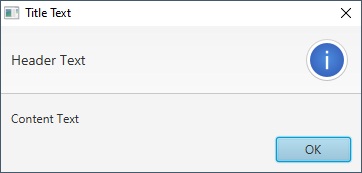
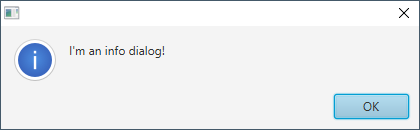
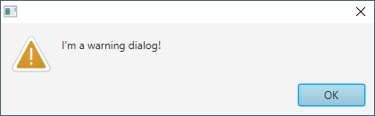
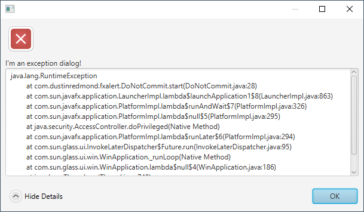
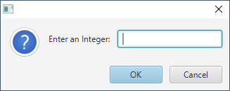
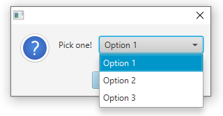

## FXAlert

[](https://search.maven.org/search?q=g:%22com.dustinredmond.fxalert%22%20AND%20a:%22FXAlert%22)

FXAlert believes that dialogs should come easy. JavaFX Alerts can be slightly convoluted.
For example, if we want to add a custom icon to a JavaFX Alert, we must create this monster:

`((Stage) this.alert.getDialogPane().getScene().getWindow()).getIcons().add(YOUR_IMAGE);`

FXAlert makes showing/creating dialogs, getting user input, graphics, icons, and using
JavaFX Alerts in general, a much smoother process.

---

### How to get FXAlert

We're on Maven Central. Use Maven or your favorite build tool.

In pom.xml
```xml
<dependency>
  <groupId>com.dustinredmond.fxalert</groupId>
  <artifactId>FXAlert</artifactId>
  <version>3.1.0</version>
</dependency>
```

In build.gradle
```groovy
compile group: 'com.dustinredmond.fxalert', name: 'FXAlert', version: '3.1.0'
```

---

### How does it work?

FXAlert's API makes it easy to create different types of dialogs. We have several ways to do this.
We can use the static methods:

 - FXAlert.info()
 - FXAlert.error()
 - FXAlert.warning()
 - FXAlert.confirm()
 - FXAlert.exception()
 - FXAlert.input()
 - FXAlert.flash()
 - FXAlert.choose()
 
These methods return  a builder-style syntax.
We can chain method calls to get the behavior we need.

```java
FXAlert.info().withText("Hello, World!").withTitleBarIcon(icon).show();
FXAlert.info().withGraphic(myGraphic).withText("Test").show();
```

---

### Title/Header/Content texts

We can set various types of text with overloaded `withText(...)` methods.

```java
FXAlert.info().withText("Title text", "Header text", "Content text").show();
FXAlert.info().withText("Header text", "Content text").show();
FXAlert.info().withText("Content text").show();
```

This will produce an Alert of type info with the given texts:



---

### Brevity, please!

If long method chains aren't your thing, we've got you covered. You can also use static convenience
methods included in FXAlert. 

```java
FXAlert.showInfo("I'm an info dialog!");
```



```java
FXAlert.showWarning("I'm a warning dialog!");
```



```java
FXAlert.showException(ex, "I'm an exception dialog!");
```

 

Note that each short-hand method, also has a builder form:
```java
try {
    DriverManager.getConnection(url);
} catch (Exception e) {
    FXAlert.exception(e).withTextFormat("Couldn't reach: %s", url).show();
}
```

---

### How about confirmation dialogs, how do those work?

```java
Optional<ButtonType> result = FXAlert.confirm().withText("Please confirm!").showAndWait();
result.ifPresent(e -> {
 // do something with our result here
});

// But, wait, I don't like Optionals.
// You should, but fine, we have you covered....

boolean okay = FXAlert.showConfirmed("Click Ok or Cancel.");
if (okay) {
    // user clicked "Ok"
} else {
    // user cancelled or closed window
}
```

This will create an Alert like below:


---

### Input Dialogs

Often times, users are asked to enter a single piece of information. 
This was a really easy dialog to build in Swing, but don't fear!
FXAlert has built-in functionality to retrieve input data. Use `FXAlert.input()`

`FXAlert.input()` works just like the other methods except instead of 
`show()` or `showAndWait()` methods, there are specific methods for getting
a particular type of data.

```java
Optional<String> aString = FXAlert.input().withText("Enter a String:").showAndWaitString();
Optional<Double> aDouble = FXAlert.input().withText("Enter a Double:").showAndWaitDouble();
Optional<Integer> anInt = FXAlert.input().withText("Enter an Integer:").showAndWaitInteger();
```

As well as returning `Optional` values, the underlying input dialog requires that
users enter the correct data type before submission and prevents entry of other data.
The allowed type is determined by the appropriate `showAndWaitXXX` method. This prevents runtime errors when trying to
parse the inputs, and saves a developer from having to check the returned data is a valid String/Double/Integer.



---

### "Flash" notifications

These are notifications that cause a banner to be temporarily displayed in the lower-right corner of the screen.
The banner appears for a few seconds, then fades out of view.

These can be built and invoked like below:

```java
FXAlert.flash()
    .withHeader("Some Header Text")
    .withContent("Some more detailed content text...")
    .show();
```

Flash notifications can display custom icons, but can also use the same bundled JavaFX
icons that we see in `Alert`s. By default, the flash notification uses the `AlertType.INFORMATION`
icon, but we can specify which we want to see by using one of the below.

```java
FXAlert.flash().error()    // AlertType.ERROR icon
FXAlert.flash().warn()     // AlertType.WARNING icon
FXAlert.flash().confirm()  // AlertType.CONFIRMATION icon
FXAlert.flash().info()     // AlertType.INFORMATION icon (default)

FXAlert.flash().withGraphic(someNodeHere) // Use a custom icon
```

While the Alert class's built-in icons are nice, in order to retrieve their icons, FXAlert must look them
up by the appropriate CSS class. Since the JavaFX stylesheet could change in a future release. It's preferred
that a developer specify their own custom "flash" notification graphic.

A `flash` notification:


---

### Choice Dialogs

Choice dialogs present the user with a list of choices from which they must pick.
This is invoked by calling the `FXAlert.choose()` method.

```java
FXAlert.choose("Option 1", "Option 2", "Option 3")
        .withText("Pick one!")
        .showAndWait();
```



---

### Documentation

FXAlert is a really simple library; most methods simply wrap JavaFX Alerts. For this reason,
no separate documentation will be maintained. If you want to get a look at what's going on behind
the scenes, check out the [AlertBuilder](./src/main/java/com/dustinredmond/fxalert/AlertBuilder.java)
class, most of the action happens there.

Each public method has thorough Javadoc. Protected, package-private, and private methods should 
also define a reasonable Javadoc if they're not straight-forward.

---

### Contributing

See [CONTRIBUTING.md](./CONTRIBUTING.md). I'm happy to have you contribute to FXAlert, but I have a few
minor beliefs on how it should be done.

In summary of CONTRIBUTING.md:
  - Write clean code
  - Use Issues and Pull Requests properly
  - Don't waste maintainers' time with small typo fixes, etc.
  - If the existing code handles something in an opinionated way,
    try to stick with that same convention.

---
